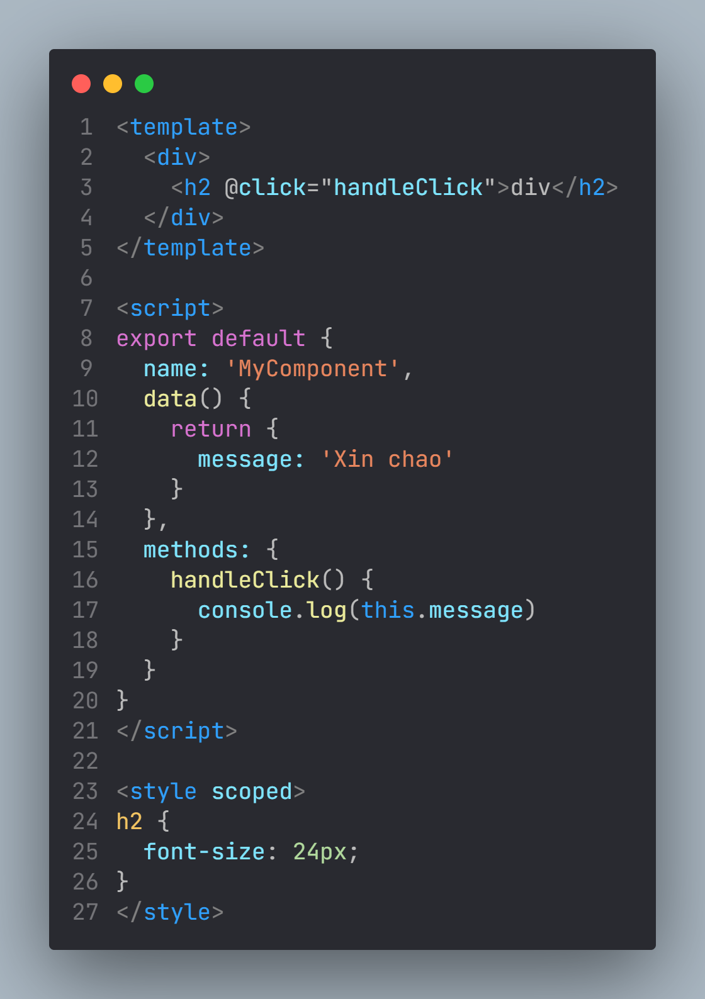
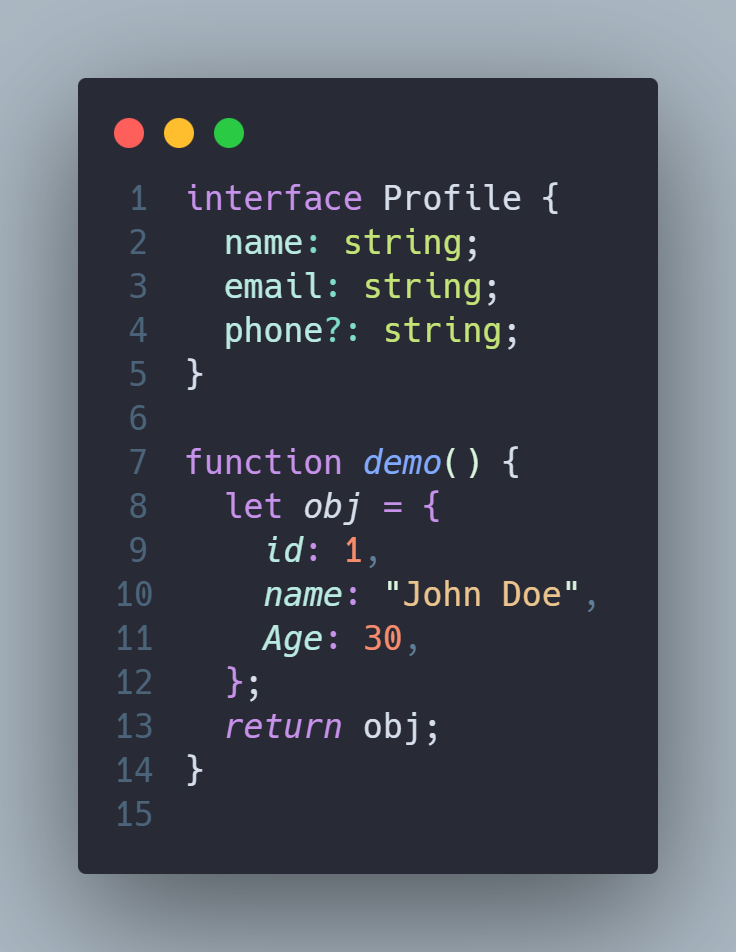
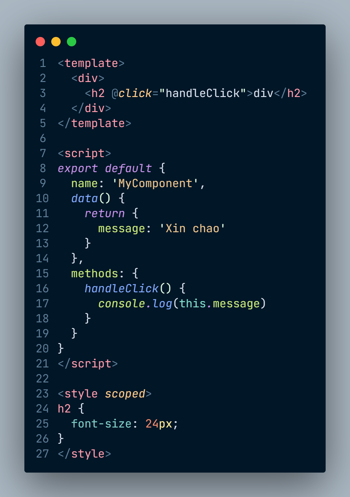

# haidark - A Dark Theme for Visual Studio Code

> "Hai" in Vietnamese means "two", and I named it haidark because it's a collection of my favorite dark themes, inspired by other popular themes with some enhancements.

## List of themes

### Haidark Default

### Haidark Nightowl

### HHaidark Mat Trang

